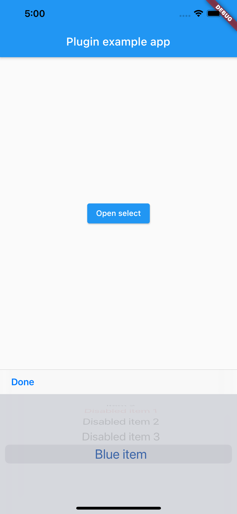
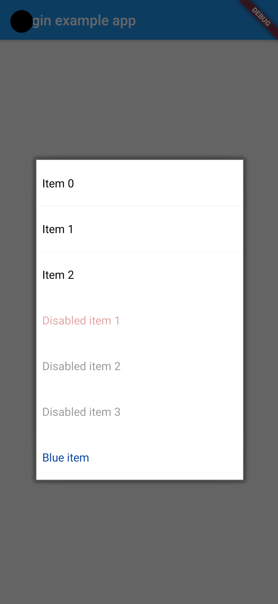

# flutter_native_select

[](https://pub.dev/packages/flutter_native_select)

A flutter plugin which can open a native select box.

## Usage

This plugin provides the `openSelect` method, which opens a select box on the screen, and returns a promise which resolves when the dialog has been dismissed. The value is `null` in case the user dismissed the dialog (pressed the back button on android), or the value of the selected item.

```dart
void showSelect() async {
  final selectedItem = await FlutterNativeSelect.openSelect(
    items: [
      NativeSelectItem(value: 'item0', label: 'Item 0'),
      NativeSelectItem(value: 'item1', label: 'Item 1'),
      NativeSelectItem(value: 'item2', label: 'Item 2'),
      NativeSelectItem(
        value: 'disabled1',
        label: 'Disabled item 1',
        disabled: true,
        color: Colors.red[900],
      ),
      NativeSelectItem(
        value: 'disabled2',
        label: 'Disabled item 2',
        disabled: true,
      ),
      NativeSelectItem(
        value: 'disabled3',
        label: 'Disabled item 3',
        disabled: true,
      ),
      NativeSelectItem(
        value: 'blue',
        label: 'Blue item',
        color: Colors.blue[900],
      ),
    ],
  );
  
  if (selectedItem == null) {
    print('User cleared or dismissed the dialog');
  } else {
    print('User selected: $selectedItem');
  }
}
```

## Screenshots

The upper code produces dialogs which are looking like that:

### iOS


### Android

